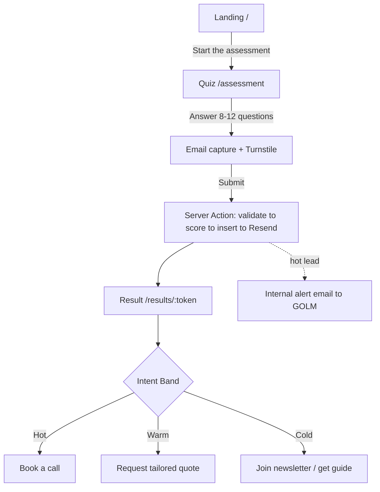

# PRD — GOLM Lead-Generation Funnel

| | |
|---|---|
| **Owner** | Dave (Founder / Technical Director, GOLM) |
| **Product** | General Operations and Logistics Management Inc. (GOLM) |
| **Status** | Draft v1 — build target: live stream, May 29 |
| **Stack** | Next.js 16 (App Router) · Tailwind · Supabase · Resend · Vercel · Claude Code |
| **Last updated** | May 29, 2026 |

---

## 1. Overview

A three-page funnel that attracts niche-industry business owners, runs them through a **scored "Custom Software Readiness" assessment**, captures them as leads in Supabase, and **sorts them by intent-to-buy** so GOLM routes each one to the right next step.

The quiz does double duty:

- **For the lead** — it returns a Readiness Score plus a short tailored breakdown. That's the value exchange that justifies their email.
- **For GOLM** — a hidden intent score derived from a handful of qualifier questions ranks the lead Hot / Warm / Cold and decides what page 3 offers them and which email fires.

The three pages map exactly to the funnel's three jobs:

1. **Landing (`/`)** — motivate the visitor to start the assessment. One conversion goal: *start the quiz*.
2. **Assessment (`/assessment`)** — the scored quiz + email capture. One conversion goal: *complete and submit*.
3. **Result (`/results/[token]`)** — reveal the score and route the lead by intent. One conversion goal: *take the matched next step*.

---

## 2. Goals & Non-Goals

**Goals**
- Generate qualified leads from niche-industry decision-makers.
- Score every lead by intent-to-buy and persist the score + band in Supabase.
- Route each lead to the right next step (book a call / request a quote / newsletter).
- Notify GOLM immediately when a Hot lead lands.
- Be buildable and demoable end-to-end inside a single stream.

**Success metrics**
- Quiz **start rate** (landing → quiz start).
- Quiz **completion + email-submit rate** (start → submit).
- **% Hot** of total submissions.
- **Booked calls** from Hot leads.

**Non-Goals (v1)**
- No payments / checkout.
- No lead login or account system.
- No full CRM — Supabase is the system of record; export/CRM sync is later.
- No multi-tenant; this is GOLM's own single funnel.
- No DB-driven quiz editor — questions live in a typed config file in code.

---

## 3. Target Lead

A business owner or operator in a **niche industry** that off-the-shelf software serves badly — so they're duct-taping spreadsheets, manual workflows, and disconnected tools. They feel the cost as wasted hours, errors, and things that won't scale. They are typically the decision-maker or close to it.

The quiz is written *for that person*: it names their pain back to them, then frames custom software as the fix GOLM builds.

---

## 4. Funnel Flow



**Key flow decisions**
- **Email is captured at the END of the quiz**, gated as "enter your email to see your results." Answering first, then asking, maximizes completion — the lead has already invested effort.
- **The score is revealed on page 3, not page 2.** The submit creates the lead row, returns an unguessable `token`, and redirects to `/results/[token]`. This keeps page 2 focused on completion and gives page 3 a clean job: reveal + route.
- The result URL is **token-based** (random UUID) so it's shareable-by-link but not enumerable.

---

## 5. Page Specs

### Page 1 — Landing (`/`)

**Job:** convince a cold visitor to spend two minutes on the assessment. Mostly a static Server Component; fast.

**Sections (copy is directional, not final):**
- **Hero** — headline on the niche-software pain → transformation ("Your industry doesn't fit the software everyone else uses. So stop forcing it."). Subhead naming the outcome. Primary CTA: **"Get your Custom Software Readiness Score — 2 min."**
- **The problem** — the manual-chaos / wrong-tool reality, stated as the lead's lived experience.
- **What GOLM does** — custom software built for niche operations and logistics; brief, credible, outcome-framed.
- **Credibility** — proof strip (clients / industries served / "X systems shipped"). Keep honest and specific.
- **What you'll get** — the quiz payoff: your score, where you're losing time/money, and whether custom software is worth it for you. This is the hook.
- **CTA repeat** — same action, bottom of page.

**Primary CTA → `/assessment`.** Carry any UTM params through the link.

**Events:** `landing_view`, `quiz_start` (on CTA click).

---

### Page 2 — Assessment (`/assessment`)

**Job:** get the lead through 8–12 questions and submit with an email. Client Component for interactivity; submits via a Server Action.

**Behavior:**
- One question (or small group) per step with a **progress bar**.
- Answers held in client state; nothing written to the DB until submit.
- After the last question: **email capture step** with name + email, **honeypot field**, and **Cloudflare Turnstile**.
- On submit → call `submitAssessment` Server Action → on success, redirect to `/results/[token]`.

**Questions probe two things:**
- **Readiness/fit** (drives the public score): pain magnitude, how badly current tools fit, industry, company size, what breaks today.
- **Intent qualifiers** (drive routing): timeline/urgency, budget, decision authority, whether they're already looking.

See **Appendix A** for a concrete starter question set with point values.

**Events:** `quiz_question_answered` (with index), `quiz_email_submitted`, `quiz_completed`.

---

### Page 3 — Result & Next Step (`/results/[token]`)

**Job:** reveal the score, then route by intent. Server Component that reads the lead by `token` server-side.

**Sections:**
- **The score** — the lead's **Readiness Score (0–100)** with a one-line interpretation and a short tailored breakdown (2–4 bullet insights generated from their answers — e.g. "You're losing ~X hours/week to manual entry").
- **The matched next step** — emphasized per intent band:
  - **Hot →** *Book a call* (booking embed / link) as the dominant CTA.
  - **Warm →** *Request a tailored quote* — a short "tell us a bit more and we'll prepare a plan" form.
  - **Cold →** *Join the newsletter / get the guide* — low-commitment nurture entry.
- All three options can appear, but layout and emphasis follow the band. This is the visible payoff of "sort by intent."

**Events:** `result_view`, `cta_book_call_click`, `cta_quote_click`, `cta_newsletter_submit`.

---

## 6. Lead Scoring & Routing

This is the core of the funnel. Two computed outputs:

**A. Readiness Score (public, 0–100)** — the friendly result shown to the lead. A composite of pain + fit + readiness, framed as "how poised your business is to benefit from custom software." Tune the curve so most engaged leads land in a satisfying 55–90 range.

**B. Intent Score (internal, 0–100) → Band** — derived from the **qualifier questions only** (timeline, budget, authority, active search). This is what routes the lead. Keeping the band logic to a small high-signal subset makes it easy to reason about and explain on stream.

**Starter intent weights (tune later):**

| Qualifier | Signal | Points |
|---|---|---|
| Timeline | "Now / this quarter" | 30 |
| | "This year" | 15 |
| | "Just exploring" | 0 |
| Budget | "Allocated / ready" | 25 |
| | "Exploring budget" | 12 |
| | "No budget yet" | 0 |
| Authority | "I decide" | 25 |
| | "I influence" | 12 |
| | "Researching for someone" | 0 |
| Active search | "Already getting quotes" | 20 |
| | "Started looking" | 10 |
| | "Not yet" | 0 |

**Bands & routing:**

| Band | Intent score | Page-3 primary CTA | Email | Internal action |
|---|---|---|---|---|
| **Hot** | ≥ 65 | Book a call | Result + booking link | Immediate alert to GOLM |
| **Warm** | 35–64 | Request tailored quote | Result + "here's how we'd approach it" | Queue for follow-up |
| **Cold** | < 35 | Join newsletter / guide | Result + nurture welcome | Add to nurture list |

Thresholds and weights are **starting values to calibrate** once real submissions come in. Store the raw `answers` so you can re-score historically without re-collecting.

---

## 7. Data Model (Supabase)

Single table, JSONB for raw answers, computed scores as first-class columns for sorting/filtering.

```sql
create table public.leads (
  id              uuid primary key default gen_random_uuid(),
  token           uuid not null default gen_random_uuid(),   -- unguessable result-page key
  created_at      timestamptz not null default now(),
  email           text not null,
  full_name       text,
  business_name   text,
  industry        text,
  answers         jsonb not null default '{}'::jsonb,         -- raw quiz answers
  readiness_score int  not null default 0,                    -- public 0-100
  intent_score    int  not null default 0,                    -- internal 0-100
  intent_band     text not null default 'cold'
                    check (intent_band in ('hot','warm','cold')),
  routed_action   text,                                       -- book_call | quote | newsletter
  status          text not null default 'new',                -- new | contacted | qualified | won | lost
  -- attribution
  utm_source      text,
  utm_medium      text,
  utm_campaign    text,
  referrer        text
);

create index on public.leads (intent_band, created_at desc);
create unique index on public.leads (token);

-- RLS on, no anon/authenticated policies.
-- The anon client can neither read nor write; ALL access is server-side via the service role.
alter table public.leads enable row level security;
```

**Why this shape:**
- `answers` as JSONB → fast to build, and you can re-score later from raw data.
- `readiness_score`, `intent_score`, `intent_band` as columns → you can sort/filter leads by intent directly in SQL or the Supabase dashboard. That *is* the "find and sort by intent" requirement.
- **RLS enabled with no policies** = a hard lock. Nothing reaches this table except your server code holding the service role key. Page 3 reads by `token` server-side.

Questions stay in a typed config file in the app (not the DB) for v1.

---

## 8. Email Automation (Resend)

Fired from the `submitAssessment` Server Action, after the insert succeeds. Templates in [react-email](https://react.email) for clean, maintainable markup.

**v1 (build on stream):**
- **Result email to the lead** — their score + breakdown + the matched CTA (booking link for Hot, etc.).
- **Internal Hot-lead alert** — to GOLM, immediately, only when `intent_band = 'hot'`. Include email, business, industry, score, answers summary so you can act fast.

**v2 (later):**
- Tiered nurture sequences (Warm: "how we'd approach your problem"; Cold: newsletter drip).

Sending is **server-side only**; the Resend key never touches the client.

---

## 9. Tech Stack & Architecture

### 9.1 The stack

| Layer | Choice | Why |
|---|---|---|
| Framework | **Next.js 16** — App Router, Server Components, Server Actions | One full-stack deploy unit; Server Actions keep secrets server-side |
| Language | **TypeScript** | Shared types across quiz config, scoring, and the submission payload |
| Host / runtime | **Vercel** (Node LTS) | Zero-config deploy, env management, preview builds |
| Styling | **Tailwind CSS** | Utility-first; your standard |
| Icons | **lucide-react** | Lightweight icons; UI hand-built in Tailwind (no component library) |
| Quiz state | **React state** (`useReducer`) | Self-contained multi-step form; no state library needed |
| Validation | **Zod** | One schema validates the submission and types the answers |
| Database | **Supabase** (Postgres) | System of record for leads; RLS-locked |
| DB access | **`@supabase/supabase-js`** — service role, server-side | Direct client is enough for one table; no ORM |
| Migrations | **Supabase CLI** (SQL) | Matches your existing migration flow |
| Email | **Resend** + **React Email** | Transactional send with typed, previewable templates |
| Anti-spam | **Cloudflare Turnstile** + honeypot | Your usual; verified server-side |
| Analytics | **GA4** + **Microsoft Clarity** | Funnel events + UTM; heatmaps and session replay |
| Monitoring | **Sentry** | Error tracking on the submit path |
| Package manager | **npm** | Lockfile committed |
| Build / repo | **Claude Code** (Max) + **GitHub** | Primary builder; version control |

**Locked:** Tailwind-only (no shadcn), Sentry in, npm. **Deferred for now:** the booking / calendar tool — page 3's Hot-lead CTA uses a plain link until one is chosen; and the production domain — interim is a temporary platform subdomain (`*.vercel.app`, or Netlify), with golm.ca subpath vs dedicated domain still to decide (§12).

**Deliberately *not* in the stack (for now):** no component library (UI is hand-built in Tailwind), no calendar / booking integration yet, no ORM (one table), no auth / login (leads aren't users), no state-management library (the quiz is local state until submit), no CMS (questions live in a typed config file). Keeping the surface small is what makes it shippable in one stream.

### 9.2 Architecture & routes

**App Router structure (Next.js 16):**

```
app/
  page.tsx                  # Page 1 — landing (RSC, static)
  assessment/
    page.tsx                # Page 2 — quiz (Client Component)
  results/
    [token]/
      page.tsx              # Page 3 — result (RSC, reads by token server-side)
  actions/
    submit-assessment.ts    # Server Action: validate → score → insert → Resend → return token
lib/
  quiz-config.ts            # questions + answer point values (typed)
  scoring.ts                # readiness + intent score functions, band thresholds
  supabase-server.ts        # server client (service role)
  resend.ts                 # Resend client + send helpers
emails/                     # react-email templates
```

**`submitAssessment` flow (skeleton, not final code):**

```ts
// 1. Validate payload with zod (answers, email, name, turnstile token, honeypot, utm)
// 2. Verify Turnstile token server-side; reject if honeypot filled
// 3. score = computeReadiness(answers); intent = computeIntent(answers); band = bandFor(intent)
// 4. insert into leads (service role) -> returns { id, token }
// 5. await resend: result email to lead; if band === 'hot' -> internal alert
// 6. return { token }  -> client redirects to /results/[token]
```

**Environment variables**

| Var | Scope | Purpose |
|---|---|---|
| `NEXT_PUBLIC_SUPABASE_URL` | public | client init (if needed) |
| `NEXT_PUBLIC_SUPABASE_ANON_KEY` | public | anon client (no table access) |
| `SUPABASE_SERVICE_ROLE_KEY` | **server only** | all lead reads/writes |
| `RESEND_API_KEY` | **server only** | transactional email |
| `NEXT_PUBLIC_TURNSTILE_SITE_KEY` | public | Turnstile widget |
| `TURNSTILE_SECRET_KEY` | **server only** | Turnstile verify |
| `BOOKING_URL` | public | Hot-lead call booking |

**Security (ties into your stream's key-handling pedagogy):**
- Service role + Resend keys live only in Server Actions / route handlers — never shipped to the browser.
- RLS on with no anon policies is the backstop if a key ever leaked client-side.
- zod validation + Turnstile + honeypot on submit.
- Good demo beat: show the network tab proving no secret leaves the server, and show RLS rejecting a direct anon write.

**Deployment:** Vercel. Server Actions run server-side; secrets stay in Vercel env, not the bundle.

### 9.3 Brand & visual direction

Reference: PrebuiltUI "Landing" (`landing.prebuiltui.com`) — **look and feel only**, not its sections. We borrow the visual language; we are *not* pulling in its trust strip, brand logos, or pricing blocks.

- **Aesthetic** — clean, modern, minimal, light theme. Generous whitespace, calm and product-forward, nothing busy.
- **Color** — light neutral base (white / off-white surfaces, soft gray borders), dark slate text, and a single accent used sparingly for CTAs and highlights, with one soft gradient "color-splash" as the only flourish. *Starting tokens, swap for GOLM's real values:* base `#FFFFFF` · surfaces `#F8FAFC` · text `#0F172A` · muted `#64748B` · accent `#4F46E5`.
- **Typography** — modern grotesque/geometric sans (Inter or similar); large, bold, tight headings; comfortable 16px body at relaxed line-height; two weights (regular + medium).
- **Surfaces** — rounded corners (~12–16px), 0.5px soft borders, very subtle shadows, card-based, generous padding. Solid accent primary button + quiet secondary.
- **Motion** — restrained: light hover lifts and fades only.

Applies across all three pages; the *content* of each stays as specced in §5 — only the visual treatment is adopted.

---

## 10. Analytics & Attribution

- **UTM capture** on landing → carried through the quiz link → written to the lead row. So you can score *channels* by Hot-lead yield, not just leads.
- **Event funnel:** `landing_view → quiz_start → quiz_question_answered → quiz_email_submitted → quiz_completed → result_view → cta_*_click`.
- **Tooling:** GA4 + Microsoft Clarity for behavior/heatmaps (your usual layer). PostHog is a strong alternative if you want first-class funnel analysis in one place — optional.

---

## 11. Build Sequence (stream run-of-show)

Rough ordering so the funnel is demoable end-to-end before polish:

1. Scaffold Next.js 16 + Tailwind, repo, Vercel project + env. *(setup)*
2. Supabase project, `leads` table + RLS, server client wired. *(foundation)*
3. **Page 1** landing — hero + sections + CTA. *(visible win early)*
4. **Page 2** quiz — `quiz-config.ts`, stepper UI, progress, state. *(the meaty part)*
5. `scoring.ts` — readiness + intent + band, with the Appendix-A weights.
6. `submitAssessment` Server Action — validate → score → insert → return token.
7. **Page 3** result — read by token, render score + breakdown, route by band.
8. Resend — result email + Hot-lead alert (react-email templates).
9. Hardening — Turnstile + honeypot + zod; the security demo beat.
10. UTM capture + analytics events.
11. Copy pass, end-to-end test (submit a fake lead of each band), deploy.

---

## 12. Decisions to Confirm

- **Niche industries** to name in landing/quiz copy (which verticals lead GOLM's positioning?).
- **Booking tool** for Hot leads — *deferred*; interim is a plain link on page 3. Revisit (Cal.com / Calendly / custom embed) when wiring the Hot-lead CTA.
- **Final question set + weights** — Appendix A is a starting point.
- **Domain** — *on hold*; interim is a temporary platform subdomain (`*.vercel.app`, or Netlify). Decide golm.ca subpath vs dedicated domain before launch.
- **Result shareability** — is a token link shareable by the lead intended, or should results expire?

---

## Appendix A — Starter Quiz (questions + point values)

Readiness questions feed the public score; qualifier questions feed intent/routing (weights in §6).

**Readiness / fit**
1. *How much of your daily operations still run on spreadsheets or manual steps?* — None / Some / A lot / Almost everything → `0 / 8 / 16 / 24`
2. *How well does your current software fit how your business actually works?* — Perfectly / Mostly / Poorly / We force it → `0 / 6 / 14 / 20`
3. *What's the cost of errors or rework from your current setup?* — Negligible / Noticeable / Significant / Constant → `0 / 8 / 16 / 22`
4. *Is your current process holding back growth?* — No / Somewhat / Yes / It's the bottleneck → `0 / 6 / 12 / 18`
5. *Company size* — Solo / 2–10 / 11–50 / 50+ → fit weighting (used for context, light points)
6. *Industry* — free text / select (stored as `industry`, used for fit + copy)

**Intent qualifiers** (see §6 for points)
7. *When do you need this solved?* — Now/this quarter / This year / Just exploring
8. *Do you have budget for a custom build?* — Allocated/ready / Exploring / Not yet
9. *Are you the decision-maker?* — I decide / I influence / Researching for someone
10. *Have you started looking for a solution?* — Already getting quotes / Started looking / Not yet

**Readiness Score** = sum of readiness points, normalized to 0–100.
**Intent Score** = sum of qualifier points (already on a 0–100 scale at max).
**Band** = `hot ≥ 65`, `warm 35–64`, `cold < 35`.
